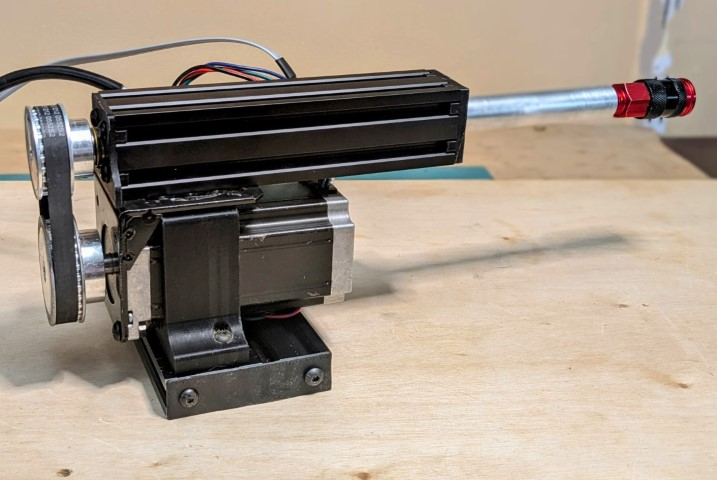
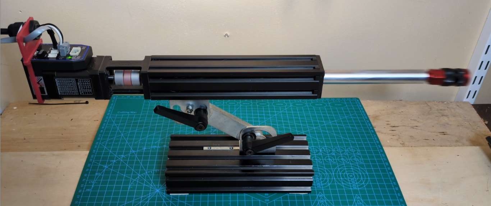

# VCylinder
Linear actuators using v-slot 

This is a repot for work related to a linear actuator (electric cylinder) using V-Slot 4040 as the body and linear bearing. There is a pulley version and an inline version. The inline version can be run with a NEMA17 motor (with realistic expectations).  The bracket with handles in the bottom pic can be found on AliExpress for under $20: 

https://www.aliexpress.us/item/3256801803680927.html

